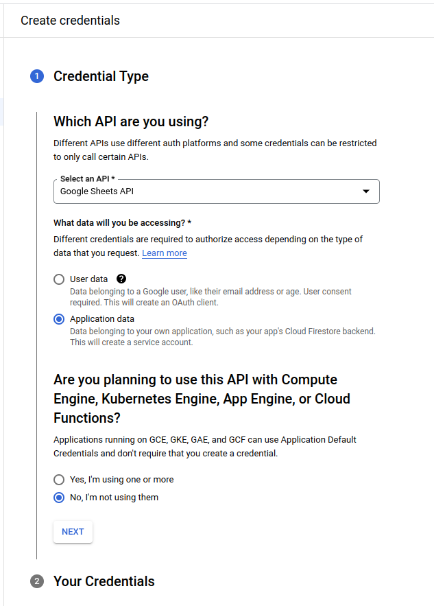

## Sheetkeeper -- automated Google Sheets maintenance

### Creating a Google Cloud Service Account

1. Go to https://console.cloud.google.com/projectcreate and create a project
2. Go to https://console.cloud.google.com/apis/api/sheets.googleapis.com and enable _Google Sheets API_ for the newly created project
3. On the top you should see the message _To use this API, you may need credentials. Click 'CREATE CREDENTIALS' to get started._ Click the blue button to the right.
4. Select _Application data_, _No_, and click _Next_.

5. Choose an arbitrary _Service account ID_ (_sheetkeeper_ will do), click _Next_
6. Click _Continue_ and _Done_
7. Go to the _Credentials_ panel (on the left) and select the newly created Service Account
8. Go to the _Keys_ tab (on top) and click _Add key_ -> _Create new key_
9. Confirm the _JSON_ type and create the key. Download the file that will pop up.
10. Base64-encode the file with the following command: `base64 -w0 <filename>.json`. This will be the contents as your `SHEETKEEPER_CREDENTIALS` variable.

### Configuration

Environment variables:

- `SHEETKEEPER_CREDENTIALS` base64-encoded Service Account credentials (see instructions above)
- `SHEETKEEPER_SHEETS` (format: `id1:sheet1:sheet2:sheet3::id2:sheet1`; IDs are spreadsheet IDs, sheets are the tab names)

S3 options (used for backup of sheet contents):

- `AWS_ACCESS_KEY_ID`
- `AWS_SECRET_ACCESS_KEY`
- `AWS_DEFAULT_REGION`
- `SHEETKEEPER_BUCKET`
- `SHEETKEEPER_S3_ENDPOINT`

### Dependencies

- boto3
- bs4
- google-api-python-client 
- google-auth-httplib2
- requests
- yt-dlp